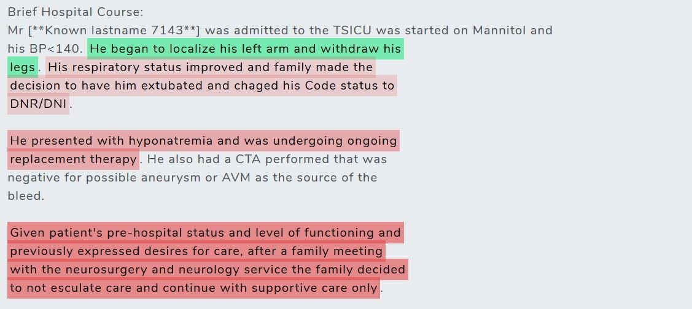
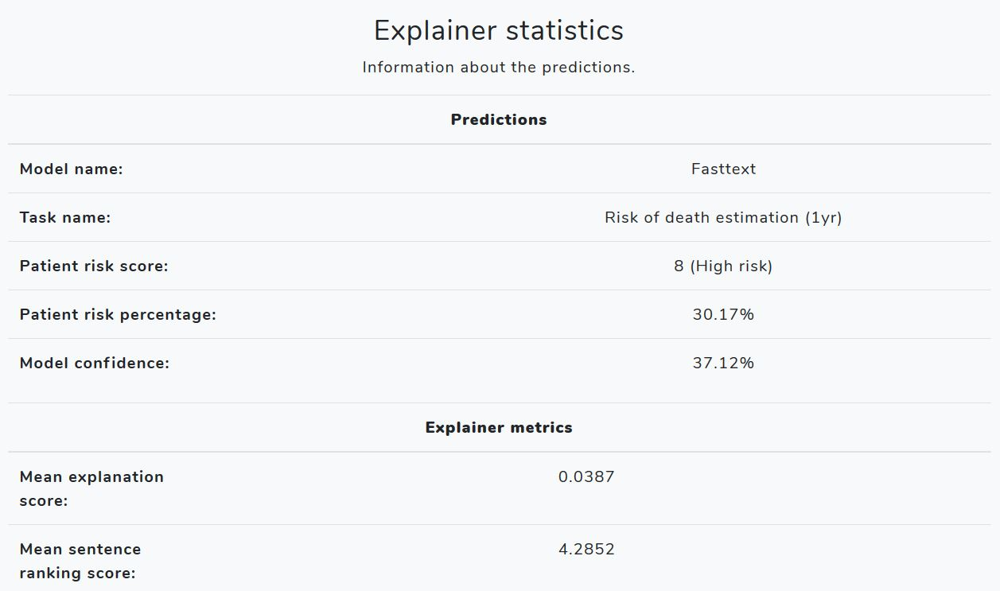

# Patient Risk Explainer

#### A model-agnostic tool for explaining text-based risk classification predictions for patients in Intensive Care Units. 

##### CS5917: MSc Project in Artificial Intelligence (Industrial Placement with the partnership of [RedStar](https://www.linkedin.com/company/red-star-ai/about/))

A LIME-based explainer for interpreting risk factors in patient discharge letters. Includes modules for sentence ranking and highlighting, alongside other statistics regarding the accumulated results. Allows the user to upload a discharge letter (as a .txt file) and generate an explanation for it, as well as select the model configuration.

##### Functionality
The app currently supports two functioning models, implemented in <b>Keras(TF2)</b>:

- Fasttext <b>(AUC: 0.85)</b>
- 1D-Conv-LSTM <b>(AUC: 0.87)</b>

The tasks supported by the explainer are:

- <b>Risk of death within 1 year</b>
- <b>Risk of hospital readmission within 30 days</b>

You can also customize the model decision boundary for positive and negative classes, which affects the risk score ([1-10]).

##### Data
The text classification models were trained on the specified tasks using the [<b>MIMIC III</b>](https://mimic.physionet.org/gettingstarted/access/) database (use the specified link to find out how to get access).

##### Frameworks
The model/explainer frameworks (in the notebooks folder) were developed using [<b>Google Colab</b>](colab.research.google.com). The web app is developed using [<b>Flask</b>](https://flask.palletsprojects.com/en/1.1.x/) (blueprint modules) and <b>Python 3.7</b>. The deployment branch includes an [<b>AWS Elastic Beanstalk</b>](https://aws.amazon.com/elasticbeanstalk/) configuration for building the production system. The app also includes a modified version of the original [<b>LIME</b>](https://github.com/marcotcr/lime) package, which includes sentence perturbations, available [<b>here</b>](https://github.com/JadeBlue96/lime). To run the explanations an NVIDIA GPU (TF2) is required (tested with GTX 960M). The front-end visualization libraries include:
- [<b>Mark.js</b>](https://markjs.io/) (Sentence highlighting with weighting for each class)
- [<b>Chart.js</b>](https://www.chartjs.org/) (Sentence importance plot)
- [<b>Bootstrap 4 template</b>](https://getbootstrap.com/)

##### Examples
<b>Sentence highlighting (green - negative, red - positive LIME explanation scores)</b>


<b>Sentence importance plot for visualizing the explanation scores.</b>


<b>Explainer statistics (related to the model predictions and explanation scores)

##### Instructions on running the system
<b>1.</b> Clone the project from this repository to your local directory using:
```bash
git clone https://gitlab.com/xai-clinical-text-analysis/patient-risk-model-explainer-ui.git 
```
<b>2.</b> Create a new conda environment to install the packages in:
```bash
conda create -n prme python=3.7
conda activate prme
```
<b>3.</b> Install the required libraries using pip:
```bash
pip install –r requirements.txt
```
<b>4.</b> Pull the model files from S3 using:
```bash
aws s3 sync s3://prme-main/ . --no-sign-request
```
<b>5.</b> Set the Flask app environment variables in your environment and run it locally:
```bash
set FLASK_APP=app.py
set FLASK_ENV=development
flask run
```
<b>6.</b> Check that every package is installed correctly and that the models are downloaded successfully by running the unit tests:
```bash
python -m pytest --cov-report term-missing --cov=src tests/
```
